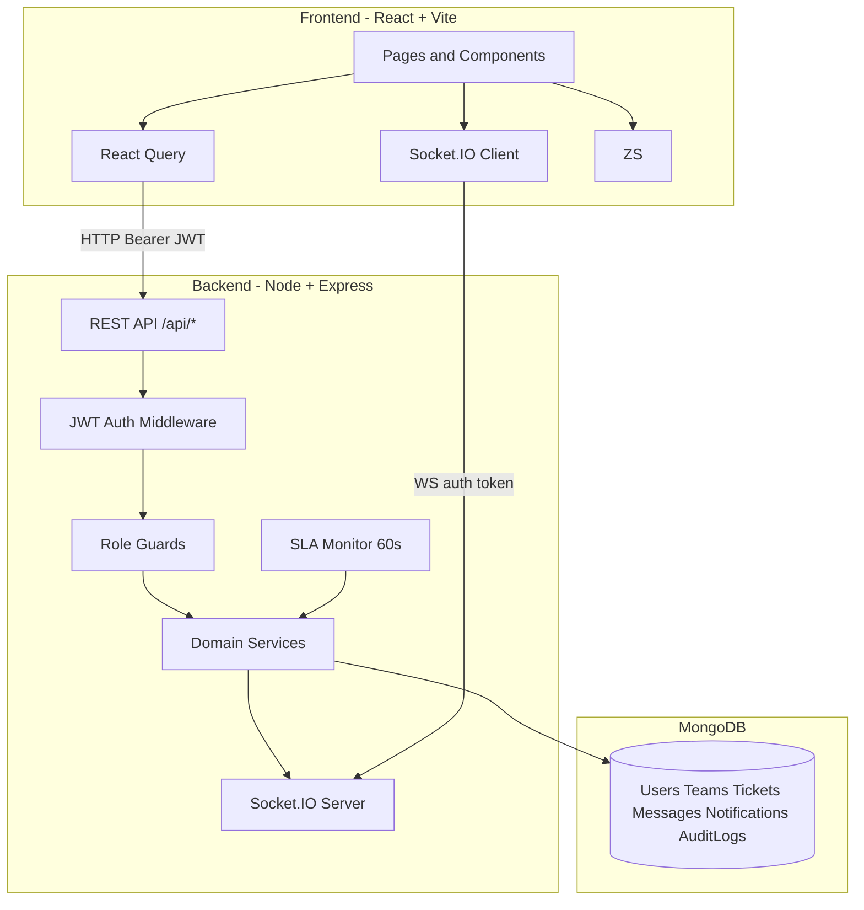
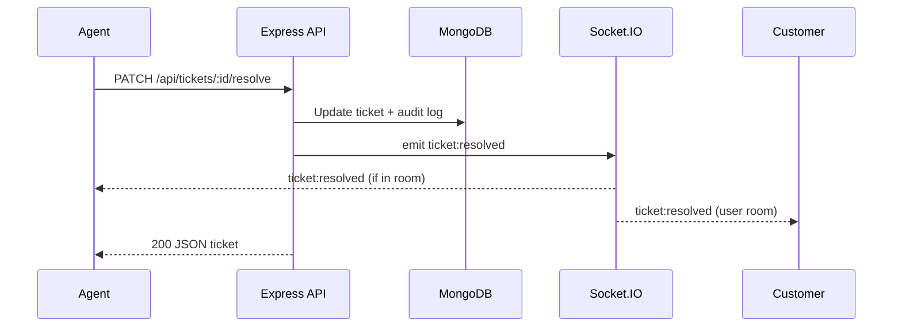

# Application Architecture (MERN Support Platform)

## High-level diagram



## Request flow (ticket update)


# Support Platform — Frontend

React 18 + TypeScript + Vite + TailwindCSS + React Query + React Router.

## Setup

```bash
cd frontend
cp .env.example .env
npm install
npm run dev
```

Set `VITE_API_URL=http://localhost:5000` (or leave empty to use Vite proxy to `/api`).

## Stack 

| Layer | Location |
|-------|----------|
| API client | `src/api/axiosInstance.ts` — Bearer token + 401 refresh retry |
| API modules | `src/api/*Api.ts` |
| React Query | `src/lib/queryClient.ts`, `src/hooks/` |
| Router | `src/routes/AppRoutes.tsx`, `ProtectedRoute`, `RoleGuard` |
| Types | `src/types/` |
| Atoms | `src/components/atoms/` — Button, Input, Spinner |

## Auth flow

- `authStore` persists tokens to `localStorage` (`support-auth`)
- `axiosInstance` attaches `Authorization: Bearer`
- On 401, calls `/api/auth/refresh` once and retries the original request

## Routes

Public: `/login`, `/forgot-password`, `/reset-password/:token`

Protected role routes: `/customer/*`, `/agent/*`, `/manager/*`, `/admin/*`

Shared: `/profile`, `/notifications`

## Auth pages 

| Route | Page |
|-------|------|
| `/login` | Email/password sign-in → role dashboard |
| `/register` | First-install admin bootstrap (auto-login) |
| `/forgot-password` | Request reset email (generic success message) |
| `/reset-password/:token` | Set new password from email link |

Demo logins after `npm run seed` in backend: `admin@example.com` / `Admin123!@#`, etc.

## Dashboards & tickets 

| Role | Routes |
|------|--------|
| Customer | `/customer/dashboard`, `/customer/tickets`, `/customer/tickets/new`, `/customer/tickets/:id` |
| Agent | `/agent/dashboard`, `/agent/queue`, `/agent/tickets/:id` |
| Manager | `/manager/dashboard`, `/manager/escalations`, `/manager/teams/:id`, `/manager/tickets/:id` |
| Admin | `/admin/dashboard`, `/admin/tickets`, `/admin/tickets/:id` |

Staff ticket detail supports assign, escalate, resolve/close/reopen, and internal notes on messages.

## Admin & analytics 

| Route | Page |
|-------|------|
| `/admin/users` | Create users, change roles, activate/deactivate |
| `/admin/teams` | Create teams, add members |
| `/admin/analytics` | Volume, categories, SLA, agent/team leaderboards |
| `/admin/audit-logs` | Filterable audit trail |
| `/manager/analytics` | Same analytics dashboard (manager + admin API) |

## Dark mode

- Toggle via **Light / Dark** in the dashboard header or on auth pages.
- Preference is saved to `localStorage` (`support-ui-theme`).
- On first visit, follows your OS `prefers-color-scheme` until you choose a theme.
- Semantic colors: `background`, `card`, `muted`, `foreground`, `border`, `input` (see `src/index.css`).

## Real-time 

Socket.IO connects when you enter any protected route (JWT in `handshake.auth.token`).

| Event | Client behavior |
|-------|-----------------|
| `ticket:*` | Refreshes React Query ticket/list caches + toasts |
| `message:new` | Refreshes message thread; typing via `message:typing` |
| `notification:new` | Updates Zustand store + sidebar badge |

**Dev without `VITE_API_URL`:** Vite proxies `/socket.io` to `http://localhost:5000` (see `vite.config.ts`).

**Production / explicit API host:**

### Demo accounts

| Role | Email | Password |
|------|-------|----------|
| Admin | admin@example.com | Admin123!@# |
| Manager | manager@example.com | Manager123!@# |
| Agent | agent@example.com | Agent123!@# |
| Customer | customer@example.com | Customer123!@# |


### Demo login

- **Customer**: `customer@example.com` / `Customer123!@#`
- **Agent**: `agent@example.com` / `Agent123!@#`
- **Manager**: `manager@example.com` / `Manager123!@#`
- **Admin**: `admin@example.com` / `Admin123!@#`

### Demo flow

Best experience: open **two browser windows** (normal + incognito) so you can show real-time updates.

1. **Customer** logs in → Sidebar → **New ticket**
2. Create a ticket (example): title “Cannot reset password”, priority “high”, category “technical”
3. On ticket detail, send a message: “I tried twice on Chrome.”
4. **Agent** logs in (incognito) → **Queue** → open the new ticket
5. Click **Assign** (assign to self/team) → reply to customer → add an **Internal note** (staff-only)
6. Click **Resolve** (then optionally **Close**)
7. **Manager** logs in → **Escalations** + **Analytics** (volume, SLA, agent/team performance)
8. **Admin** logs in → **Users** / **Teams** → **Audit logs** to show traceability
# VITE_SOCKET_URL=http://localhost:5000
```
